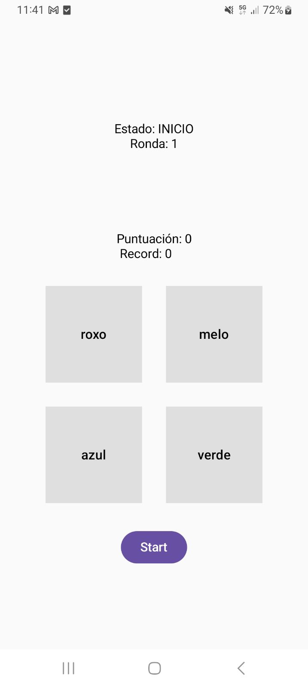

# Simon Dice — Jorge e Oliver (Persistencia)

Autoría: Jorge D.C.

Un xogo "Simon Dice" para Android con persistencia local. Esta aplicación está preparada para compilarse con o Gradle Wrapper incluído no proxecto e usa Jetpack (Compose/Room/KSP) e as configuracións de toolchain do proxecto.

> [!note]
> Este README está en galego e contén instruccións concisas para compilar, instalar e probar a aplicación.

## Resumo

Aplicación Android (módulo `app`) que implementa o clásico xogo "Simon Dice" con mecanismos de persistencia local para gardar o estado e puntuacións. O proxecto usa o Gradle Wrapper, Kotlin e a toolchain Java 17.

## Tecnoloxías principais

- Kotlin
- Android Gradle Plugin
- Jetpack (Room, KTX, etc.)
- Gradle Wrapper (usar `./gradlew`)

## Requisitos

- JDK 17 (o proxecto especifica toolchain Java 17)
- Android SDK Platform 36 (compileSdk = 36)
- Gradle: usar o Gradle Wrapper do proxecto (gradle 8.13)
- Android Studio recomendado (será compatible coa configuración do proxecto)
- OUTRAS: `adb` (platform-tools) no PATH para instalar en dispositivos físicos

> [!warning]
> A carpeta `assets/` non foi detectada; porén hai imaxes en `imgs/` e iconas en `app/src/main/res/mipmap-*`. Neste README utilízanse esas rutas como fonte dos logos/screenshot. Se preferes, move os logos a `app/src/main/assets/`.

## Comandos útiles

Executa estes comandos desde a raíz do repositorio:

- Ver versión do Gradle Wrapper e ambiente:

```bash
./gradlew --version
```

- Compilar APK de debug:

```bash
./gradlew assembleDebug
```

- Instalar APK de debug en dispositivo/emulador conectado:

```bash
./gradlew installDebug
```

- Compilar APK de release (requere configurar keystore):

```bash
./gradlew assembleRelease
```

- Executar tests unitarios:

```bash
./gradlew test
```

- Executar tests instrumentados (requere dispositivo/emulador conectado):

```bash
./gradlew connectedAndroidTest
```

- Instalar manualmente con adb (se prefires):

```bash
adb install -r app/build/outputs/apk/debug/app-debug.apk
```

## Execución en Android Studio

Abre a raíz do proxecto en Android Studio; a IDE usará o Gradle Wrapper e a configuración existente. Asegúrate de ter instaladas as plataformas do SDK necesarias (API 36).

## Activos e logos

As rutas onde se poden atopar os recursos gráficos do proxecto:

- Iconas de lanzador: `app/src/main/res/mipmap-*/ic_launcher*` e `app/src/main/res/drawable/`
- Imaxes de documentación / screenshots: `imgs/1.jpeg`, `imgs/2.jpeg`, `imgs/3.jpeg`, `imgs/4.jpeg`

Podes inserir unha captura no README con:

```markdown

```

Se desexas incluír logos específicos desde unha carpeta `assets/`, crea `app/src/main/assets/` e coloca alí os ficheiros, ou usa as imaxes en `imgs/` como están.

## Probas

- Tests unitarios: `./gradlew test`
- Tests instrumentados: `./gradlew connectedAndroidTest` (necesita un dispositivo/emulador conectado)

## Release

Xerar unha versión release require configurar un keystore e as propiedades de sinatura en `app/build.gradle.kts` ou nun ficheiro `keystore.properties` (non inclúese no repositorio). Recomendacións:

- Non comites keys privadas ao repositorio.
- Configura `signingConfigs` no `build.gradle.kts` para produce artefactos asinados.

## Contribuír

Se queres colaborar, crea unha fork, fai os teus cambios nunha rama con nome claro e abre un pull request explicando a modificación. Abre issues para bugs ou melloras.

## Notas finais e asuncións

- Asumín que os recursos visuais que queres empregar para o README están en `imgs/` dada a ausencia dunha carpeta `assets/` no proxecto.
- As versións e configuracións (Gradle Wrapper 8.13, AGP 8.13.0, Kotlin 2.0.21, compileSdk 36, toolchain Java 17) foron detectadas nas configuracións do proxecto; usa o Gradle Wrapper para compatibilidade.

Se queres, podo:

- Mover as imaxes de `imgs/` a `docs/screenshots/` e insertar exemplos no README.
- Engadir capturas no READMe e optimizar o texto de instalación.

---
Pequena guía: abre un issue ou dime cales cambios queres para adaptar o README (por exemplo, engadir screenshots incorporadas, máis detalles sobre a arquitectura, ou instrucións para o keystore).
