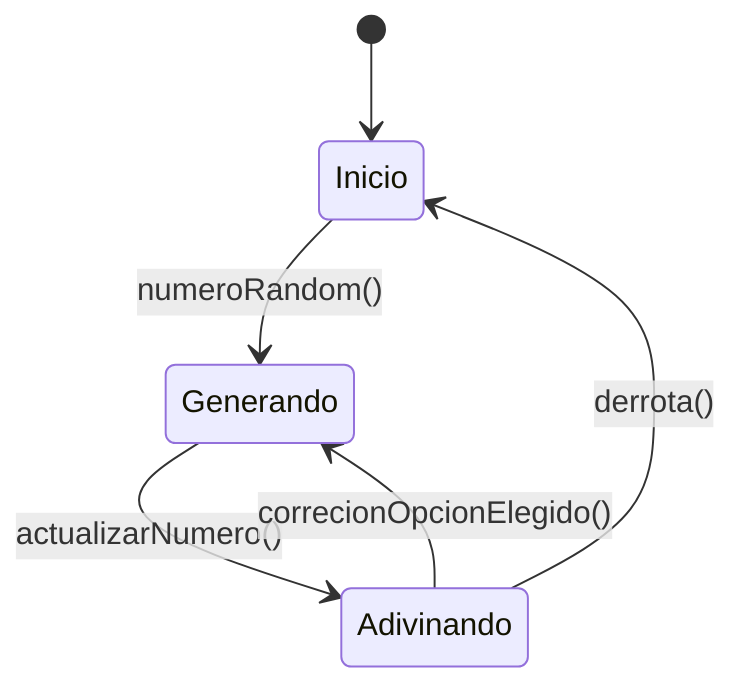

# Simón No Dice

## Oliver Miguez Alonso

## Jorge Duran Cruz

### Explicación:

Se basa en el clásico juego del simón dice, principalmente centrandonos en el uso de corrutinas y el modelo MVVM,
completamente desarrollado en ***Kotlin*** y ***JetPack Compose*** de Android Studio.

### Funcionamiento

Cuando inicias la aplicación, se verán todos los botones apagados menos el botón "start" que iniciara el juego 

Cuando juegas la aplicación, se mostraran las distintas secuencias de colores y sonidos que tendremos que adivinar, y se ira sumando puntuación

Cuando pierdes en la aplicación, se resetearan los puntos, volveremos al inicio,se actualiara el valor del record y deberemos de volver a pulsar el botón start para reiniciar el juego 

Cuando vuelves a jugar en la aplicación, genera una nueva secuencia de juego

### Justificación de diseño

Hemos decidido utilizar la corrutinas y el modelo MVVM, ya que nos proporcionan un control sobre el código ademas de una estructura organizada y concisa para programar.
Ademas hemos trabajado organizando nuestras tareas en nuestro repositorio de github a través de los commits, branchs y tags, ademas de crear  utilizar un proyecto para organizar todo.

### Proyecto

[Proyecto](https://github.com/users/oliver-miguez/projects/4)

### Diagrama de estados:

