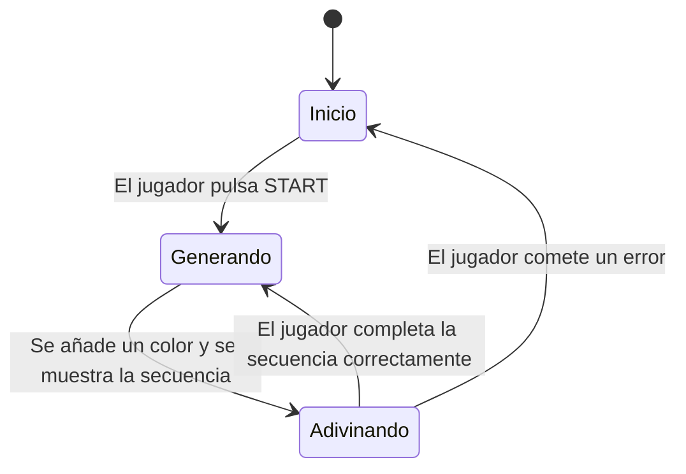

# Simón No Dice

## Autores:
- Oliver Miguez Alonso
- Jorge Duran Cruz

---

### Descripción del Juego

"Simón No Dice" es una adaptación para móviles del clásico juego de memoria "Simón Dice". El objetivo es simple: observar la secuencia de colores y sonidos que genera el juego y repetirla en el mismo orden. ¡Pon a prueba tu memoria y consigue la puntuación más alta!

Este proyecto ha sido desarrollado de forma nativa para Android utilizando las tecnologías más modernas, como **Kotlin**, **Jetpack Compose** para la interfaz de usuario, **Coroutines** para la gestión de tareas asíncronas y una arquitectura **MVVM (Model-View-ViewModel)**.

---

### ¿Cómo se Juega?

El funcionamiento del juego es sencillo e intuitivo:

**1. Pantalla de Inicio**

Al abrir la aplicación, te encontrarás en la pantalla inicial. El juego está en espera. Para comenzar una nueva partida, simplemente pulsa el botón **"START"**.

**2. Comienza la Secuencia**

Una vez iniciada la partida, el juego iluminará una secuencia de colores, acompañada de un sonido distintivo para cada color. Presta mucha atención, ya que tu objetivo es repetir la secuencia tocando los botones en el orden correcto. Con cada ronda que superes, la secuencia se hará un poco más larga y el desafío aumentará. Tu puntuación se incrementará con cada acierto.

**3. Fin de la Partida**

Si cometes un error en la secuencia, la partida terminará. Tu puntuación se reiniciará, y si has superado el récord anterior, ¡tu nueva puntuación se guardará como el nuevo récord! Para volver a intentarlo, pulsa de nuevo el botón "START".

**4. Una Nueva Partida, un Nuevo Reto**

Cada vez que inicies una nueva partida, el juego generará una secuencia completamente nueva y aleatoria. ¡Nunca habrá dos partidas iguales!

---

### Diseño y Arquitectura

Para el desarrollo de este proyecto, se ha optado por un stack tecnológico moderno basado en:
- **Modelo MVVM:** Separa la lógica de negocio de la interfaz de usuario, facilitando el mantenimiento, la escalabilidad y el testing del código.
- **Jetpack Compose:** Permite construir la interfaz de usuario de forma declarativa y moderna con Kotlin, reduciendo la cantidad de código y acelerando el desarrollo.
- **Coroutines de Kotlin:** Se utilizan para gestionar las tareas asíncronas, como los retardos en la secuencia de colores, de una manera eficiente y sin bloquear el hilo principal, garantizando una experiencia de usuario fluida.

---

### Gestión del Proyecto

Toda la planificación y seguimiento de tareas se ha gestionado a través de un tablero de proyecto en GitHub, utilizando metodologías ágiles.

- **[Enlace al Proyecto en GitHub](https://github.com/users/oliver-miguez/projects/4)**

---

### Diagrama de Estados del Juego

El flujo principal del juego se puede representar con el siguiente diagrama de estados:

