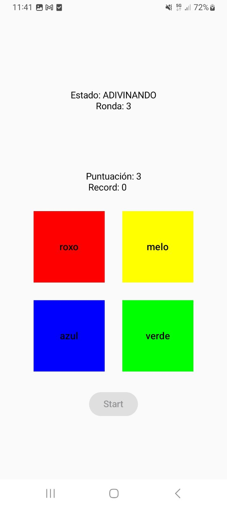
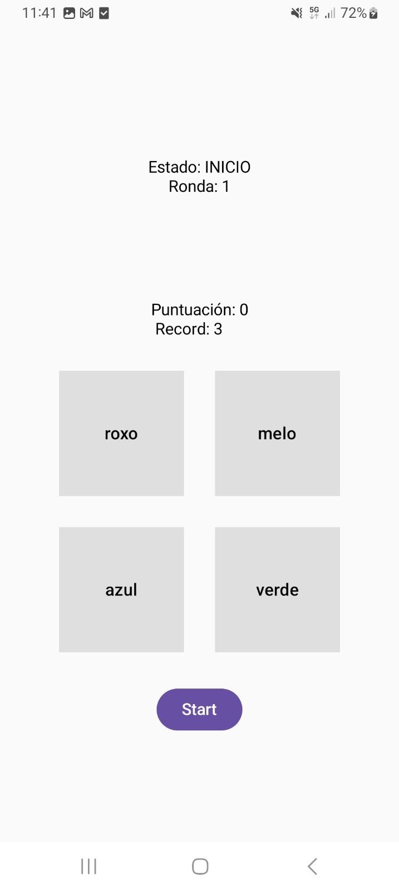
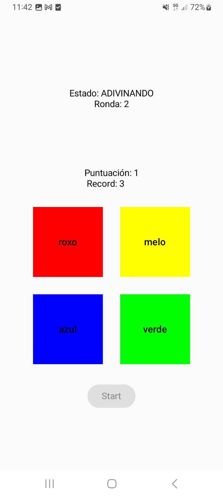
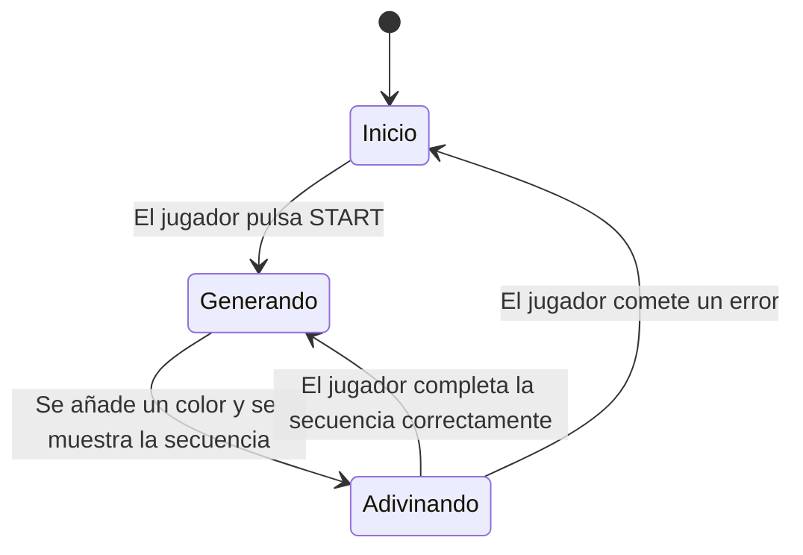

# Simón No Dice

## Autores:
- Oliver Miguez Alonso
- Jorge Duran Cruz

---

### Descripción del Juego

"Simón No Dice" es una adaptación para móviles del clásico juego de memoria "Simón Dice". El objetivo es simple: observar la secuencia de colores y sonidos que genera el juego y repetirla en el mismo orden. ¡Pon a prueba tu memoria y consigue la puntuación más alta!

Este proyecto ha sido desarrollado de forma nativa para Android utilizando las tecnologías más modernas, como **Kotlin**, **Jetpack Compose** para la interfaz de usuario, **Coroutines** para la gestión de tareas asíncronas y una arquitectura **MVVM (Model-View-ViewModel)**.

---

### ¿Cómo se Juega?

El funcionamiento del juego es sencillo e intuitivo:

**1. Pantalla de Inicio**

Al abrir la aplicación, te encontrarás en la pantalla inicial. El juego está en espera. Para comenzar una nueva partida, simplemente pulsa el botón **"START"**.

**2. Comienza la Secuencia**

Una vez iniciada la partida, el juego iluminará una secuencia de colores, acompañada de un sonido distintivo para cada color. Presta mucha atención, ya que tu objetivo es repetir la secuencia tocando los botones en el orden correcto. Con cada ronda que superes, la secuencia se hará un poco más larga y el desafío aumentará. Tu puntuación se incrementará con cada acierto.

**3. Fin de la Partida**

Si cometes un error en la secuencia, la partida terminará. Tu puntuación se reiniciará, y si has superado el récord anterior, ¡tu nueva puntuación se guardará como el nuevo récord! Para volver a intentarlo, pulsa de nuevo el botón "START".

**4. Una Nueva Partida, un Nuevo Reto**

Cada vez que inicies una nueva partida, el juego generará una secuencia completamente nueva y aleatoria. ¡Nunca habrá dos partidas iguales!

---

### Diseño y Arquitectura

Para el desarrollo de este proyecto, se ha optado por un stack tecnológico moderno basado en:
- **Modelo MVVM:** Separa la lógica de negocio de la interfaz de usuario, facilitando el mantenimiento, la escalabilidad y el testing del código.
- **Jetpack Compose:** Permite construir la interfaz de usuario de forma declarativa y moderna con Kotlin, reduciendo la cantidad de código y acelerando el desarrollo.
- **Coroutines de Kotlin:** Se utilizan para gestionar las tareas asíncronas, como los retardos en la secuencia de colores, de una manera eficiente y sin bloquear el hilo principal, garantizando una experiencia de usuario fluida.

---

### Gestión del Proyecto

Toda la planificación y seguimiento de tareas se ha gestionado a través de un tablero de proyecto en GitHub, utilizando metodologías ágiles.

- **[Enlace al Proyecto en GitHub](https://github.com/users/oliver-miguez/projects/4)**

---

### Diagrama de Estados del Juego

El flujo principal del juego se puede representar con el siguiente diagrama de estados:

```mermaid
    stateDiagram-v2
    [*] --> Inicio
    Inicio --> Generando: El jugador pulsa START
    Generando --> Adivinando: Se añade un color y se muestra la secuencia
    Adivinando --> Generando: El jugador completa la secuencia correctamente
    Adivinando --> Inicio: El jugador comete un error
```

## Room

Para la persistencia de datos en la aplicación, se ha implementado la biblioteca **Room**, que proporciona una capa de abstracción sobre SQLite para permitir un acceso más robusto a la base de datos, aprovechando al mismo tiempo todo el potencial de SQLite.

La implementación se estructura en los siguientes ficheros clave:

### 1. `RecordEntity.kt` - La Entidad

Esta clase de datos define la tabla que almacenará los récords en la base de datos.
-   `@Entity`: Marca la clase para que Room la reconozca como una tabla.
-   `@PrimaryKey(autoGenerate = true)`: Define el `id` como la clave primaria, que se generará automáticamente con cada nuevo registro.
-   `@ColumnInfo`: Permite especificar nombres personalizados para las columnas, como "Puntuación" y "Fecha".

### 2. `RecordDao.kt` - El DAO (Data Access Object)

Esta interfaz define cómo se accede a los datos de la tabla `RecordEntity`.
-   `@Dao`: Identifica la interfaz como un objeto de acceso a datos para Room.
-   `@Query`: Permite escribir consultas SQL personalizadas. En este caso, se usa una consulta clave para obtener el récord con la puntuación más alta: `SELECT Puntuación, Fecha FROM RecordEntity ORDER BY Puntuación DESC LIMIT 1`.
-   `@Insert` y `@Delete`: Definen métodos sencillos para insertar y eliminar récords.

### 3. `AppDatabase.kt` - La Base de Datos

Esta clase abstracta representa la base de datos principal de la aplicación.
-   `@Database`: Anotación que define la clase como la base de datos de Room. Se especifican las entidades (tablas) que contiene (`RecordEntity`) y la versión de la base de datos.
-   Hereda de `RoomDatabase`.
-   Declara un método abstracto que devuelve una instancia del `RecordDao`, permitiendo que el resto de la aplicación acceda a los métodos del DAO.

### 4. `ControllerRoomSQLite.kt` - El Controlador

Esta es la clase que une todas las piezas y gestiona la lógica de la base de datos.
-   **Inicializa la base de datos**: Usando `Room.databaseBuilder`, crea una instancia única de `AppDatabase`. Es importante destacar que se ha usado `.allowMainThreadQueries()`, una opción que permite realizar consultas en el hilo principal. Aunque es útil para simplificar el código en proyectos pequeños, en aplicaciones más grandes se recomienda realizar las operaciones de base de datos en hilos secundarios (usando, por ejemplo, coroutines) para no bloquear la interfaz de usuario.
-   **Implementa la interfaz `HandlerRecord`**: Proporciona los métodos `setRecord` y `getRecord` que se comunican con el DAO para insertar y obtener los récords, gestionando también la conversión entre el `String` de la base de datos y los objetos `LocalDateTime`.